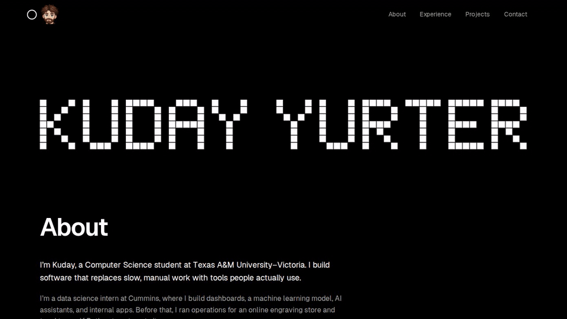

<div align="center">


# Kuday Yurter

**My portfolio: one black page, lettered in pixels.**

[Live site](https://kudayyurter.dev) · [How it works](#how-it-works) · [Run locally](#run-locally)



</div>

Source for [kudayyurter.dev](https://kudayyurter.dev), where I show my experience, the tools I use, and what I've built at work and on my own. Section headings resolve from coarse pixel blocks as you scroll to them, and it's done without any animation library.

## What it does

- **Pixel lettering:** the name at the top is drawn from a hand-made 5×7 dot font, rendered as crisp SVG.
- **Headings that resolve:** each section title sharpens from 16 px blocks to full detail the first time it scrolls into view.
- **Real logos:** the tech stack, companies, schools and contact links use the brands' own marks.
- **Works without JavaScript:** the page is server-rendered and complete; motion is only a layer on top.
- **Respects reduced motion:** with `prefers-reduced-motion` or in print, everything shows in its final state.
- **Contact in one click:** copy the email, or open GitHub or LinkedIn, from the inverted contact section.

## How it works

<p align="center">
  
  
  
  
  
  
</p>

| Path | What's there |
|---|---|
| [`src/content/portfolio.ts`](src/content/portfolio.ts) | All the copy; edit this to change the page |
| [`src/app/page.tsx`](src/app/page.tsx) | Page markup, server-rendered |
| [`src/components/`](src/components) | Pixel name, heading reveal, header, copy button |
| [`src/lib/`](src/lib) | Pixel font, pixelation, the motion check |
| [`src/app/opengraph-image.tsx`](src/app/opengraph-image.tsx) | The link-preview image |
| [`public/logos/`](public/logos) | Every logo, as SVG |
| [`tests/`](tests) | Playwright tests |

- **Real text under the pixels:** a heading is normal markup; a canvas snapshot laid over it steps from coarse to sharp in about 600 ms and then hides, so the text itself stays readable to screen readers and without JavaScript.
- **One motion switch:** CSS and JavaScript gate motion on the same media query (scripts on, no reduced-motion preference), so they never disagree about whether to animate.

Checks, CI and deploy notes are in [docs/development.md](docs/development.md).

## Run locally

Requires Node.js 20.19+, 22.13+ or 24+ (CI uses Node 24).

```bash
npm install
npm run dev
```

Then open [localhost:3000](http://localhost:3000).

## Credits and license

Code is [MIT](LICENSE). Logos are trademarks of their owners.

<details>
<summary>Logo sources</summary>

- **Tech stack:** [Devicon](https://devicon.dev) (MIT), [Simple Icons](https://simpleicons.org) (Databricks, CC0), Microsoft's official [Power Platform icons](https://learn.microsoft.com/power-platform/guidance/icons) (Power Platform, Copilot Studio), and Wikimedia Commons (Power BI; Tux by Larry Ewing, lewing@isc.tamu.edu, created with The GIMP). Dark single-color marks (Rust, Unreal, Unity, the AWS wordmark) are recolored white to show on black.
- **Companies and schools:** Cummins and University of Houston from Wikimedia Commons (the Cummins badge's missing fill set to Cummins red); Texas A&M University–Victoria from the university's own approved-logos files (its dark gray text switched to the white version it publishes for dark backgrounds).
- **Contact:** GitHub and LinkedIn from Devicon (the GitHub mark in its white dark-background version), Gmail from Wikimedia Commons.

</details>
